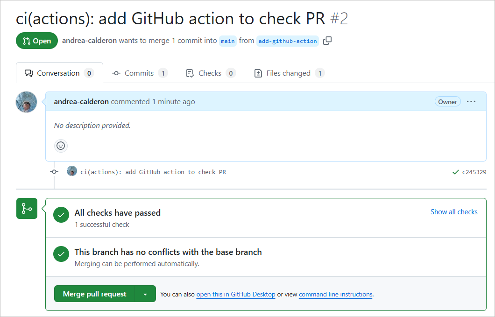

# TypeScript Bootcamp

 

Learning and practice repository for the TypeScript Developer Bootcamp. It includes exercises, examples, and resources to improve TypeScript skills.

## Description
This repository is designed to develop a deeper understanding of TypeScript. Here you’ll find:
- Code examples structured by modules.
- Hands-on practice and exercises.
- GitHub Actions setup to check code and run automated tests on every pull request.

## GitHub Actions

This repository uses a **GitHub Action** that triggers when a pull request is opened targeting the `main` branch. This action performs the following steps:
1. Prints a message to the console with an environment variable.
2. Prints a message to the console with a secret configured in GitHub.

### Output Example

## Associated Documentation

- **[TypeScript Official Documentation](https://www.typescriptlang.org/docs/)**: Comprehensive guide to TypeScript.
- **[Node.js Documentation](https://nodejs.org/en/docs/)**: Node.js documentation, useful for TypeScript environments.
- **[MDN Web Docs](https://developer.mozilla.org/)**: General documentation on JavaScript and web technologies.

## Environment Variables

This project uses the following environment variables for its configuration in GitHub Actions:

- `MY_VARIABLE`: Contains an informative message that is printed in the action log.
- `MY_SECRET`: Used to print a secret message to the console (configured in the repository’s **Settings > Secrets**).

To configure `MY_SECRET`:
1. Go to the repository **Settings** > **Secrets and variables** > **Actions** > **New repository secret**.
2. Name the secret `MY_SECRET` and assign it a value.

## Related Links

- [Bootcamp Repository](https://github.com/your-username/repo-name)
- [TypeScript on GitHub](https://github.com/microsoft/TypeScript)
- [GitHub Actions Documentation](https://docs.github.com/en/actions)

## Screenshots

Below are screenshots showing the project flow:

1. **GitHub Action Output**:
   

2. **Pull Request View**:
   

